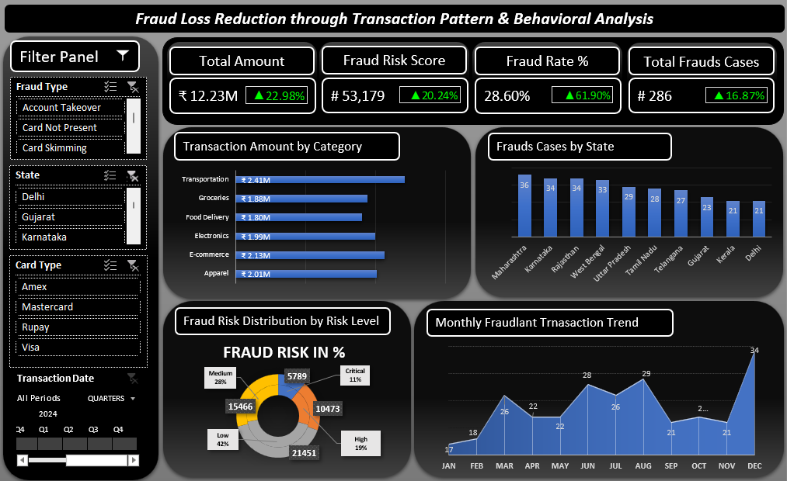
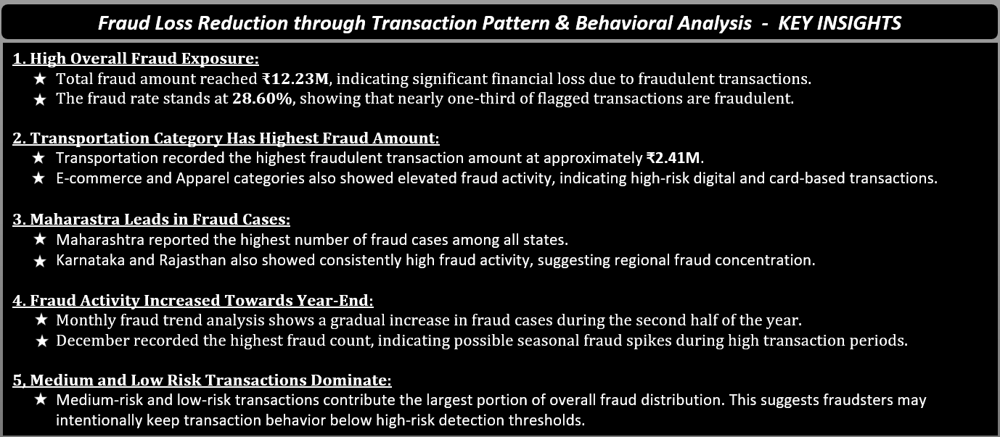
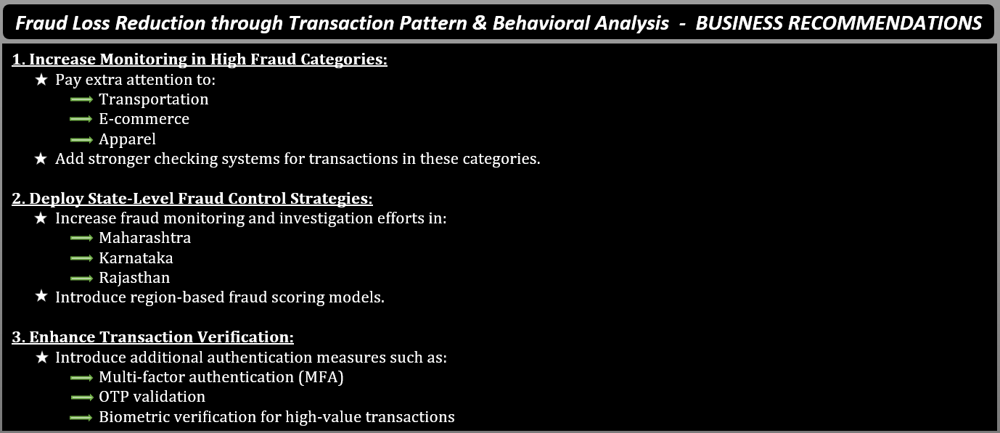

# 📊 Fraud Loss Reduction Through Transaction Pattern & Behavioral Analysis dashboard - Excel

## 📌 Project Overview

This project focuses on analyzing **Fraudulent Transaction** to identify **fraud patterns, high-risk transaction categories, regional fraud concentration, and monthly fraud trends**.

The interactive dashboard was created in **Microsoft Excel** using **Pivot Tables, Pivot Charts, KPIs, Slicers, and Interactive Visualizations** to help businessess monitor fraud activities and reduce financial losses.

---

## 🚨 Business Problem

Fraudulent transaction can cause major financial losses and reduce customer trust. Businesses often face challenges in:

- Detecting **suspicious transaction patterns**.
- Identifying **high-risk categories and regions**.
- Monitoring **fraud trends over time**.
- Preventing **fraudulent activities** before losses increase.

This project helps solve these issues through **data-driven fraud analysis and visualization**.

---

## Table of Contents

- [Project Overview](#-project-overview)
- [Business Problem](#-business-problem)
- [Objectives](#-objectives)
- [Dashboard Features](#-dashboard-features)
- [Key KPIs](#-key-kpis)
- [Dashboard Images](#dashboard-images)
- [Key Insights](#-key-insights)
- [Business Recommendations](#-business-recommendations)
- [Dataset Information](#-dataset-information)
- [Dataset Source](#-dataset-source)
- [Tools & Technologies](#️-tools--technologies)
- [Data Cleaning & Preparation](#-data-cleaning--preparation)
- [Project Workflow](#-project-workflow)
- [Project Impact](#-project-impact)
- [Project Structure](#-project-structure)
- [How to Use](#️-how-to-use)
- [Author & Contact](#author--contact)

---

## 🎯 Objectives

- Analyze **fraudulent transaction** behavior.
- Identify **high fraud categories and states**.
- Monitor **monthly fraud trends**.
- Understand **fraud risk distribution**.
- Create an **interactive Excel dashboard** for business monitoring.
- Provide actionable **business recommendations**.

---

## 📈 Dashboard Features

- ✅ **Total Fraud Amount**
- ✅ **Fraud Risk Score**
- ✅b**Fraud Rate Percentage**
- ✅ **Total Fraud Cases**
- ✅ **Transaction Amount by Category**
- ✅ **Fraud Cases by State**
- ✅ **fraud Risk Distribution**
- ✅ **Monthly Fraud Trend Analysis**
- ✅ **Interactive Slicers & Filters**

---

## 📊 Key KPIs

- Total Fraud Amount                    = **₹12.23M**
- Fraud Risk Score                      = **53,179**
- Fraud Rate %                          = **28.60%**
- Total Fraud Cases                     = **286**

---

## 📸 Dashboard Images

### Main Dashboard

- Provides an interactive overview of **fraud amount, fraud rate, fraud cases, transaction categories, fraud risk distribution, and monthly fraud trends** across different states and transaction types.

### Key Insights

- Highlights major analytical findings such as **high fraud categories, states with maximum fraud activity, year-end fraud increase, medium-risk transaction patterns, and overall fraud behavior trends**.

### Business Recommendations

- Presents **data-driven recommendations** to improve fraud monitoring, strengthen transaction verification, reduce financial losses, enhance fraud detection systems, and support better business security decisions.

---

## 📈 Key Insights

### 📌 High fraud Loss
- Total Fraud amount reached approximately **₹12.23M**.
- Fraud transaction account for **28.60%** of suspicious transactions.

### 📌 Transportation Category Has Highest Fraud
- Transportation recorded the **highest fraud transaction amount**.
- **E-commerce and Apparel categories** also showed high fraud activity.

### 📌 Maharashtra Recorded Highest Fraud Cases
- Maharashtra has the highest number of fraud cases.
- Karnataka and Rajasthan also showed high fraud activity.

### 📌 Fraud Increased Towards Year-End
- Fraud cases increased during the second half of the year.
- December recorded the highest fraud count.

### 📌 Medium and Low Risk Transactions Dominate
- Most fraud cases belong to medium-risk and low-risk transaction groups.
- Fraudsters may try to behave like normal customers to avoid detection.

---

## 🚀 Business Recommendations

1. **Increase Monitoring in High Fraud Categories** 
Focus more on:
- **Transportation**
- **E-commerce**
- **Apparel**
Apply stronger transaction monitoring systems in these categories.

2. **Deploy State-Level Fraud Monitoring**
Increase fraud monitoring in:
- **Maharashtra**
- **Karnataka**
- **Rajasthan**

3. **Enhance Transaction Verification**
Introduce:
- **OTP verification**
- **Multi-factor authentication**
- **Biometric verification for high-value transactions**

4. **Improve Fraud Detection System**
Use smarter fraud monitoring systems to detect **suspicious transactions** quickly.

5. **Increase Monitoring During Peak Months**
Fraud cases rise during **year-end periods and busy transaction seasons**.

6. **Monitor Medium-Risk Transactions Carefully**
Medium-risk transactions contribute significantly to fraud cases and should be monitored closely.

---

## 📂 Dataset Information

The dataset contains **Credit Card Transactions records** used for **fraud risk analysis**. It includes information related to:

- Transaction Details
- Customer Details
- Merchant Information
- Transaction Amount Analysis
- Fraud Risk Classification
- Fraud Type Detection
- Card Type Analysis
- Bank-wise Transaction Analysis
- Transaction Category Analysis
- Merchant Location Details
- State-wise Fraud Analysis
- Fraud Score Evaluation

---

## 📂 Dataset Source

Dataset obtained from Kaggle and further cleaned/transformed for dashboard analysis.

Download Dataset Here:
[Download Dataset](data/Credit_Card_Fraud_Risk_Analysis.csv)

---

## 🛠️ Tools & Technologies

- **Microsoft Excel**
- **Pivot Tables**
- **Pivot Charts**
- **Power Query Editor**
- **Slicers**
- **Conditional Formatting**
- **KPIs Cards**
- **Dashboard Design**
- **Data Cleaning Techniques**

---

## 🧹 Data Cleaning & Preparation

The following **data cleaning & preparation** steps were performed:

- Checked **missing values**
- **Removed duplicate records**
- **Standardized Column** Formats
- Verified **data consistency**
- Created **calculated KPIs**
- Built **Pivot Tables for analysis**
- Structured data for **dashboard reporting**

---

## 🔄 Project Workflow

Raw Dataset
    ↓
Data Cleaning & Preparation
    ↓
Pivot Table Creation
    ↓
KPI Calculation
    ↓
Dashboard Design
    ↓
Key Insights Generation
    ↓
Business Recommendations

---

## 💡 Project Impact

- Helps identify high-risk fraud areas quickly
- Supports faster business decision-making
- Improves fraud monitoring and transaction security
- Helps reduce financial losses due to fraud
- Provides interactive reporting for management teams

---

## 📂 Project Structure

```bash
Credit_Card_Transaction_Fraud_Analysis_Dashboard/
│
├── Readme.md
├── .gitignore
├── Credit_Card_Fraud_Analysis_Report.pdf
│
├── dashboard/                                  # Excel Dashboard File
│   └── Fraud_Loss_Reduction_through_Fraud_Patterns_and_Behaviour_Analysis.xlsm
│
├── data/                                       # Excel Original Dataset
│   └── Credit_Card_Fraud_Risk_Analysis.csv
│
└── images/                                     # Images
    ├── Fraud_Analysis_Dashboard.png  
    ├── Key_Insights.png   
    └── Business_Recommendations.png
```

---

## ⚙️ How to Use

1. Download the Excel Workbook.
2. Open the .xlsm file in Microsoft Excel.
3. Enable editing and macros if prompted.
4. Use slicers and filters to interact with the dashboard.
5. Explore different analysis sheets for insights.

---

## 👨‍💻 Author & Contact

Dhammadeep Gajbhiye
Data Analyst
- Email: dhammdeepgajbhiye32@gamil.com
- LinkedIn: (https://linkedin.com/in/dhammadeep-gajbhiye-57b38b16a/)
- GitHub: (https://github.com/dhammdeepgajbhiye32)


⭐ If you like this project

Give it a ⭐ on GitHub and share your feedback.
